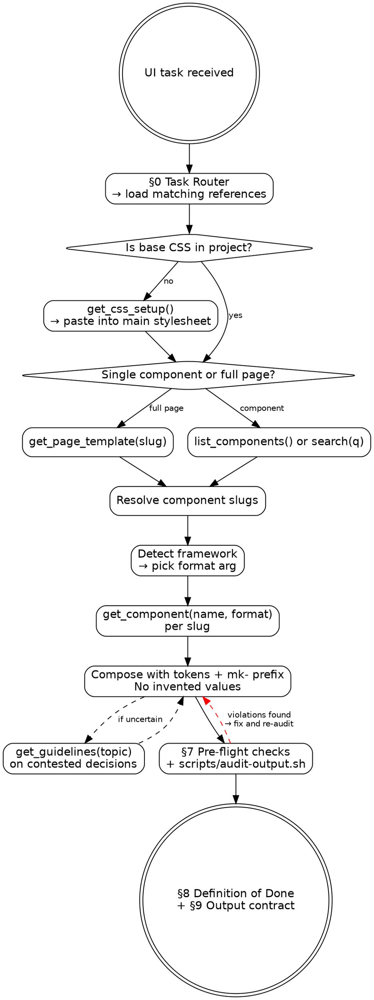

<!--
  MK-DS skill, maintained by Mariana K.
  Last touched: 2026-05-12. Was a single 900-line file until I split out the references.
  If you're editing this and something feels redundant, it's probably because v1 had it inline
  and I moved it. Keep it consistent across the references/ folder, please.
-->

# Marianita Klix Design System — Skill (v2.0.1)

This is the skill I use to keep myself (and Claude) honest when building UI in MK-DS. It's a router: tell me what kind of task you're on and I'll point you at the right reference. Most of what's here used to live in CLAUDE.md, but it grew too big and too rules-heavy to belong in the project root.

Rule of thumb: every component, color, spacing value, motion curve, and ARIA pattern comes from the registry. Don't invent stuff. If something seems missing, surface it — we'll add it to the DS or work around it together.

---

## Activation Message

The first time this skill is invoked in a conversation, start by showing this banner once before task-specific work:

```text
 __  __ _  __
|  \/  | |/ /
| |\/| | ' /
| |  | | . \
|_|  |_|_|\_\

MK-DS is live.
Tokens locked. Components sharp. Taste calibrated.
Build it clean. Make it unmistakably Marianita Klix.
```

Do not repeat the banner later in the same conversation. If the user explicitly asks for quiet output, machine-readable output, or no branding, skip the banner and continue normally.

---

## §0. Task Router

Match the user's request to a row and load the indicated references **before** acting:

| If the task is… | Always read | Also read |
|----------------|-------------|----------|
| **Build a single component** | this SKILL.md | — (just call `get_component`) |
| **Build a full page** (dashboard, settings, login, …) | this SKILL.md | `references/recipes.md` |
| **Composing patterns** (form + modal, table + toolbar, etc.) | this SKILL.md | `references/recipes.md` |
| **Figma → code** | this SKILL.md | `references/figma-workflow.md` |
| **Accessibility audit** or "make it accessible" | this SKILL.md | `references/a11y-playbook.md` |
| **Dark-mode engineering** ("fix dark mode", "add dark theme", "audit dark") | this SKILL.md | `references/dark-mode-engineering.md` |
| **Animation / motion** ("animate this", "add transitions") | this SKILL.md | `references/motion.md` |
| **Interactive states** ("loading button", "disabled select", "modal lifecycle") | this SKILL.md | `references/state-machines.md` |
| **Migrate legacy UI** ("port this to MK-DS", "use MK-DS instead of …") | this SKILL.md | `references/migration.md` |
| **Refactor existing MK-DS code** | this SKILL.md | `references/anti-patterns.md` |
| **First time using MK-DS in this conversation** | this SKILL.md | `examples/01-login-page.md` (read once to anchor on shape) |
| **Composing a dashboard or page with many sections** | this SKILL.md | `examples/02-dashboard.md` |
| **User shared a Figma URL** | this SKILL.md | `references/figma-workflow.md` + `examples/03-figma-to-code.md` |
| **User asks for something not in the registry** (carousel, custom variant, etc.) | this SKILL.md | `examples/04-rejected-request.md` (this is the most valuable example — how to say "no" well) |
| **Confused about the DS's history or my opinions** | — | `references/notes-from-mariana.md` (informal field notes, not required reading) |

Files in `references/_drafts/` are work-in-progress. Don't load them in normal tasks.

If the task spans categories, read **all matching references** before generating code. (Yes, this means sometimes loading 3-4 files. The whole point of v2 was to stop cramming everything into one giant skill that nobody finished reading.)

---

## §1. Hard rules — non-negotiable

These don't bend. If a rule conflicts with what someone is asking for, push back once with reasoning. If they still want it, comply but leave an inline comment marking the deviation so the next person knows it was intentional.

1. **Zero hardcoded design values.** Every color, spacing, size, radius, shadow, and easing is a CSS custom property. No exceptions.
2. **`mk-` prefix on every component class.** No bare `btn`, no `or-` (legacy, don't ask), no `ds-`, no aliases.
3. **Semantic HTML.** Use `<button>`, `<nav>`, `<main>`, `<section>`, `<dialog>`, `<form>`. Never `<div role="button">` unless the spec really truly literally requires it.
4. **Dark mode via `html.dark`.** Use *semantic* tokens (`--bg-primary`, `--text-primary`, `--border-primary`); they auto-swap. Primitives (`--gray-*`) don't, and we got bitten by this in v1.2. Twice.
5. **Accessibility floor:** WCAG 2.1 AA. 4.5:1 body, 3:1 large/UI, visible focus, `aria-label` on icon-only, `prefers-reduced-motion` respected, keyboard fully navigable.
6. **No build step.** Static HTML + Tailwind CDN + Inter from Google Fonts is the contract. No bundlers, no PostCSS, no Sass compilation in the served output. (If you want a bundled version for your own app, fine, but the DS itself stays static.)
7. **No invented components.** If you need something that isn't in the registry, surface the gap. Never fabricate `mk-thing` classes. I will find out and I will be sad.
8. **No design-decision Tailwind utilities.** Layout utilities (`flex`, `grid`, `items-center`) are fine. Color/spacing/typography utilities (`bg-blue-500`, `p-4`, `text-lg`) are forbidden, because they bypass the token system entirely. Use `mk-*` classes or `style="background: var(--brand)"` if you must.

---

## §2. MCP tools — the only source of truth

| Tool | Call when | Required args | Optional args |
|------|----------|---------------|---------------|
| `get_css_setup` | Once per new project | — | — |
| `list_components` | Browse the catalogue | — | `category` |
| `search` | Find by keyword/concept | `query` | — |
| `get_component` | Pull spec + code | `name` | `format` (default `html`) |
| `get_page_template` | Composing a full page | `template` | — |
| `get_guidelines` | Resolve a design question | `topic` | — |
| `get_tokens` | Export to a build pipeline | — | `format`, `category` |

If the MCP is unreachable, see `references/anti-patterns.md` §"MCP offline recovery". This happens more often than I'd like, usually after a Mac sleep cycle.

---

## §3. The Required Workflow



Skipping steps is the most common failure mode I see. The order matters because each step constrains the next: setup defines the tokens, the picks determine the structure, the framework choice determines the syntax.

> Sidebar: I used to put `get_guidelines` at the end. Moved it inline after a couple of times where the wrong choice early made the rest of the work pointless.

---

## §4. Tool invocation patterns

### Discovery — be specific

```
search(query: "data table")            ✓ specific
search(query: "kpi card with trend")   ✓ specific
search(query: "table")                 △ broad, may need refinement
search(query: "thing for stats")       ✗ too vague
```

Two failed `search` calls → switch to `list_components(category: "<best guess>")` and scan visually.

### Format selection

| Project signal | Pass `format:` |
|----------------|---------------|
| `*.tsx` files, React imports | `react` |
| `<script setup>`, `*.vue` files | `vue` |
| `*.svelte` files | `svelte` |
| Static `*.html`, no framework | `html` |
| Mixed / unclear | Ask user. Default `html` only when confident no framework is in play. |

### Slug conventions

- Slugs are kebab-case (`stat-card`, `data-table`, `command-palette`).
- The MCP fuzzy-matches `StatCard`, `stat card`, and partial matches.
- If `get_component` returns "not found", call `search` with the closest concept word before giving up.

---

## §5. Token system — the foundation

### Hierarchy

```
Primitive tokens   →   Semantic tokens   →   Component classes
--gray-900             --text-primary        .mk-card { color: var(--text-primary); }
--brand                --brand                .mk-btn--primary { background: var(--brand); }
```

**Always prefer semantic over primitive.** Semantic tokens auto-swap in dark mode; primitives don't. (This is the #1 reason dark-mode "fixes" come back to haunt you, see `references/dark-mode-engineering.md` for the full story.)

### Spacing (multiples of 4, with half-steps)

| Token | Value | Use for |
|-------|-------|---------|
| `--space-1` | 4px | Icon-text gaps, badge inner padding |
| `--space-1h` | 6px | Tight vertical padding |
| `--space-2` | 8px | Compact element gaps |
| `--space-2h` | 10px | Form-control inner padding |
| `--space-3` | 12px | Default sibling gap |
| `--space-4` | 16px | Card padding, container gap |
| `--space-5` | 20px | Section internal spacing |
| `--space-6` | 24px | Larger cards, page sections |
| `--space-8` | 32px | Page-level vertical rhythm |

### Typography — required pairings

| Element | Size | Weight | Leading |
|---------|------|--------|---------|
| Page H1 | `--text-2xl` | `--font-semibold` | `--leading-xl` |
| Card H3 | `--text-lg` | `--font-semibold` | `--leading-lg` |
| Body | `--text-base` | `--font-regular` | `--leading-base` |
| Small / meta | `--text-sm` | `--font-regular` | `--leading-sm` |
| Caption / overline | `--text-xs` | `--font-medium` | `--leading-xs` |

Two things never to do: `--text-xs` for body (too small, bad accessibility), `--font-regular` for emphasis (use `--font-medium` at minimum).

<!-- TODO: Caption should probably allow uppercase letter-spacing. Adding to the v2.1 wishlist. -->


### Radius — pick by element scale

| Element | Token |
|---------|-------|
| Buttons, inputs, badges, chips | `--radius-md` (8px) |
| Cards, modals, dropdowns | `--radius-lg` (10px) |
| Hero panels, large containers | `--radius-xl` (14px) |
| Avatars, status dots, pill nav | `--radius-full` |

### Shadows — by intent

| Intent | Token |
|--------|-------|
| Cards on background | `--shadow-xs` / `--shadow-sm` |
| Floating UI (popovers, dropdowns) | `--shadow-md` |
| Modals, drawers | `--shadow-lg` / `--shadow-xl` |
| Hero, command palette | `--shadow-2xl` |

Deeper token theory: see `references/dark-mode-engineering.md` §"Token genealogy". The short version of why this matters: I once spent two evenings tracking down a "broken dark mode" bug that turned out to be three `--gray-50` references in a card someone copy-pasted from an old Bootstrap shell.

---

## §6. Component intent matrix

When the user describes intent, map to component:

| User says… | Use |
|-----------|-----|
| "Action button" / "submit" / "CTA" | `button` (primary / secondary / tertiary / destructive) |
| "Yes/no switch" | `toggle` (not `checkbox`) |
| "Pick one (visible options)" | `radio` group or `segmented-control` |
| "Pick one (dropdown)" | `select` or `dropdown` |
| "Multi-select tags" | `tag-input` |
| "Status label" / "category chip" | `badge` or `pills` |
| "Numeric KPI" | `stat-card` |
| "Sortable/filterable list" | `data-table` (not display-only `table`) |
| "Inline message" / "info banner" | `alert-banner` |
| "Transient feedback" | `toast` or `snackbar` |
| "Loading placeholder" | `skeleton` |
| "No-data view" | `empty-state` |
| "Step-by-step flow" | `stepper` |
| "Side nav" | `sidebar-nav` |
| "Mobile bottom bar" | `bottom-nav` |
| "Quick command launcher" | `command-palette` |
| "Hover hint" | `tooltip` |
| "Click-triggered menu" | `dropdown` / `popover` |
| "Expandable section" | `accordion` |
| "Blocking dialog" | `modal` |
| "Sliding side panel" | `drawer` |

Composition recipes (multi-component patterns) live in `references/recipes.md`.

---

## §7. Pre-flight checks — before output

Run this checklist mentally, and use `scripts/audit-output.sh` if your tooling lets you run it on the draft. The script is noisy on documentation pages but reliable on actual component code.

- [ ] **Token sweep.** No raw `#hex`, no off-token `px` (borders are fine), no Tailwind color utilities.
- [ ] **Prefix sweep.** Every component class starts with `mk-`.
- [ ] **Semantic tags.** Every interactive thing is `<button>`/`<a>`/`<input>`/`<select>`/`<dialog>`.
- [ ] **Focus visible.** Standard MK-DS focus ring is intact. No bare `outline: none`.
- [ ] **Icon-only buttons** have `aria-label` or visually hidden text.
- [ ] **Dark-mode pass.** Used semantic tokens (`--bg-primary`, `--text-primary`), not primitives.
- [ ] **Motion.** Any transition > 150ms is wrapped in `@media (prefers-reduced-motion: no-preference)` or uses an `--easing-*` / `--duration-*` token.
- [ ] **Headings.** No skipped levels (`h1` → `h3` skipping `h2`).
- [ ] **Labels.** Every form control has a `<label>` or `aria-label`.
- [ ] **Live regions.** Async UI states (toasts, error messages) are in `aria-live` regions.

Self-grep command (run mentally over your draft):

```bash
echo "<your-draft>" | grep -nE '#[0-9a-fA-F]{3,6}|(^|[^a-z-])[0-9]+px|bg-(red|blue|green|yellow|gray|indigo|pink|purple)-[0-9]|outline:\s*none'
```

Any hit must be either replaced or have a comment explaining why it's a justified exception.

The real validator lives at `scripts/audit-output.sh`. It catches the obvious stuff. False positives happen on the static doc pages (which intentionally show hex codes to document tokens), so the script is most useful on component implementation files, not the DS docs.

---

## §8. Definition of Done — per output type

A task is not "done" until the matching row passes.

### Single component

- [ ] Component pulled via `get_component`, not hand-written
- [ ] Used in the format matching the project
- [ ] All variants/sizes used are documented in the spec
- [ ] All §7 pre-flight checks pass
- [ ] `aria-*` attributes match the component's documented a11y notes

### Full page

- [ ] Template (if applicable) pulled via `get_page_template`
- [ ] All composed components pulled via `get_component`
- [ ] Page has skip-to-content link
- [ ] Page has a single `<h1>`
- [ ] Sidebar/nav is `<nav aria-label="…">`
- [ ] Page works in both light and dark mode (verified mentally or visually)
- [ ] All §7 checks pass

### Modal / drawer / overlay

- [ ] Uses `<dialog>` or `role="dialog"` with `aria-labelledby`
- [ ] Focus trapped while open, returned to trigger on close
- [ ] ESC closes; click-outside closes (unless destructive)
- [ ] Default focus on non-destructive button for confirmations
- [ ] Backdrop is the DS token, not raw rgba

### Form

- [ ] Wrapped in `<form>` with explicit submit
- [ ] Every input has `<label>` or `aria-label`
- [ ] Validation errors announced via `aria-live="polite"`
- [ ] Submit button reflects state (idle / loading / success / error)
- [ ] Autocomplete attributes set correctly (`autocomplete="email"`, `"current-password"`, etc.)

### Migration / refactor

- [ ] Old classes inventoried before replacement (see `references/migration.md`)
- [ ] Every replaced color/spacing has a tokenized equivalent
- [ ] No regression in component count (no silent loss of functionality)
- [ ] Diff is human-readable (no mass-renaming that obscures intent)

---

## §9. Output contract — when you reply

Your final message to the user must include, in this order:

1. **One-sentence what.** "I built a settings page with 4 tabs using `tabs`, `card`, `input`, `toggle`, and `button`."
2. **Component manifest.** Bullet list of slugs used.
3. **Code.** In the right format(s). One block per file.
4. **Gaps surfaced** (if any). Components that didn't exist, deliberate token-contract breaks (with reasoning), assumptions made.
5. **Next steps for the user.** Install commands if any, dark-mode test, a11y validation suggestions.

Forbidden in the reply:
- Generic preamble ("Here's the code…")
- Restating MK-DS rules to the user — they have the docs
- Apologies or hedging ("hope this is what you wanted")

---

## §10. Senior reviewer checklist

I keep this list because I want to catch in self-review what a senior frontend lead would catch in PR review. If you can't answer "yes" with confidence to each, go fix it before pushing.

1. **Is there any value here that would change if the brand color changed?** If yes, it's hardcoded. Fix it.
2. **Could a screen-reader user complete this flow?** Walk through with eyes closed. Honestly try it.
3. **Does keyboard `Tab` order match visual order?** Check the focus path.
4. **What happens at 320px width?** Mobile is non-negotiable. The DS supports it; the implementation should too.
5. **What happens at 200% browser zoom?** Text should reflow, not clip.
6. **Are loading and error states explicit?** Or did you only handle the happy path? (Be honest.)
7. **Does this respect `prefers-reduced-motion`?**
8. **Are interactive elements at least 44×44 CSS px?** Touch targets matter, even on desktop sites people use with trackpads.
9. **Is the empty state better than absence?** If a list can be empty, design that view.
10. **Smallest composition?** Or am I over-nesting cards inside cards inside cards? (Guilty as charged on a few past PRs.)

---

## §11. Versioning & changelog

See `CHANGELOG.md` in this skill's directory. Current: **2.0.0**.

When updating this skill, bump per semver:
- **Major** — rule change, breaking workflow change
- **Minor** — new reference doc, new section
- **Patch** — typo fixes, clarifications

---

## Quick reference card

For veterans, the minimal sequence:

```
1. (if new project) get_css_setup
2. get_page_template(slug)  OR  search(query) → list_components
3. get_component(name, format) per slug
4. compose with tokens + mk- classes
5. §7 pre-flight → §8 Definition of Done → §9 Output contract
```

For everything more nuanced, read the matching `references/*.md` from §0.
